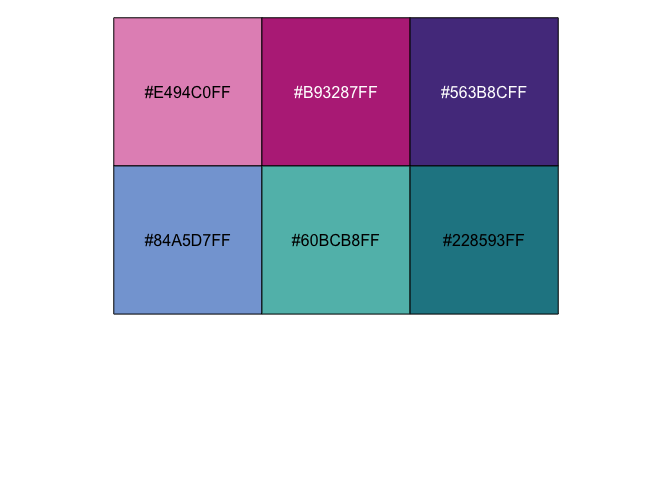
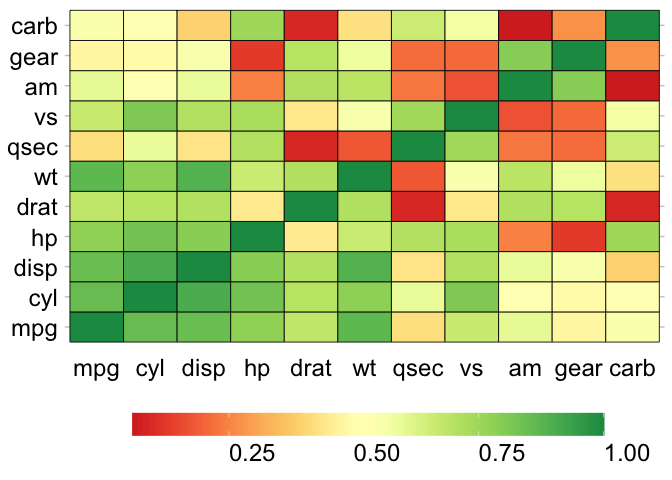
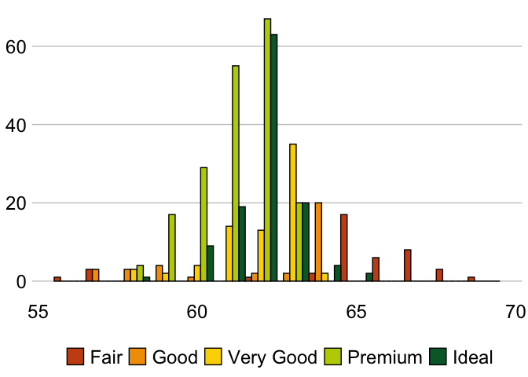
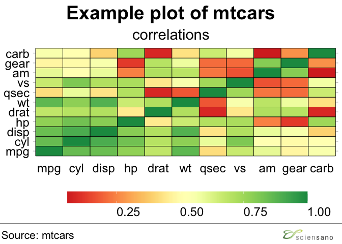

<!-- README.md is generated from README.Rmd. Please edit that file -->

# GGSANO

<!-- badges: start -->

[](https://github.com/sciensanogit/ggsano/actions)
<!-- badges: end -->

<<<<<<< HEAD
The goal of ggsano is to make the Sciensano color and housestyle
available in R. The creation of this package was based on the [bbplot
package](https://github.com/bbc/bbplot), a package with the same
intetions createb by the BBC. So *kudos* to the BBC team.
=======
The goal of ggsano is to standardize and implement the Sciensano
housestyle within R. The ggsano package currently provides three
categories of important functions: sciensano\_style, sciensano\_colours
and sciensano\_templates. The sciensano\_style functions can handle a
ggplot2-object and recompile it according to the Sciensano house style.
The sciensano\_colours functions return the Sciensano house style
colours in HEX format (‘\#XXXXXX’). Both discrete and continuous scales
are available. The package is based on the functions as implemented by
the [bbplot package](https://github.com/bbc/bbplot). So *kudos* to the
BBC team.
>>>>>>> dbba8879304e6659f5d2acb3d6724bf30bdfbc27

## Installation

You can install the latest version of ggsano from
[GitHub](https://github.com/) by running the following code:

``` r
# install.packages("devtools")
devtools::install_github("sciensanogit/ggsano")
```

The package can be loaded in R by:

``` r
library(ggsano)
#> Scanning ttf files in C:\WINDOWS\Fonts ...
#> Extracting .afm files from .ttf files...
#> C:\Windows\Fonts\arial.ttf
#> Warning in system2(ttf2pt1, c(args, shQuote(ttfiles[i]),
#> shQuote(tmpfiles[i])), : running command '"C:/Users/RoDe1798/Documents/R-4.0.2/
#> library/Rttf2pt1/exec/ttf2pt1.exe" -a -G fAe "C:\Windows\Fonts\arial.ttf" "C:
#> \Users\RoDe1798\AppData\Local\Temp\RtmpUn47Vs/fonts/arial"' had status 5
#>  : No FontName. Skipping.
#> C:\Windows\Fonts\arialbd.ttf
#> Warning in system2(ttf2pt1, c(args, shQuote(ttfiles[i]),
#> shQuote(tmpfiles[i])), : running command '"C:/Users/RoDe1798/Documents/R-4.0.2/
#> library/Rttf2pt1/exec/ttf2pt1.exe" -a -G fAe "C:\Windows\Fonts\arialbd.ttf" "C:
#> \Users\RoDe1798\AppData\Local\Temp\RtmpUn47Vs/fonts/arialbd"' had status 5
#>  : No FontName. Skipping.
#> C:\Windows\Fonts\arialbi.ttf
#> Warning in system2(ttf2pt1, c(args, shQuote(ttfiles[i]),
#> shQuote(tmpfiles[i])), : running command '"C:/Users/RoDe1798/Documents/R-4.0.2/
#> library/Rttf2pt1/exec/ttf2pt1.exe" -a -G fAe "C:\Windows\Fonts\arialbi.ttf" "C:
#> \Users\RoDe1798\AppData\Local\Temp\RtmpUn47Vs/fonts/arialbi"' had status 5
#>  : No FontName. Skipping.
#> C:\Windows\Fonts\ariali.ttf
#> Warning in system2(ttf2pt1, c(args, shQuote(ttfiles[i]),
#> shQuote(tmpfiles[i])), : running command '"C:/Users/RoDe1798/Documents/R-4.0.2/
#> library/Rttf2pt1/exec/ttf2pt1.exe" -a -G fAe "C:\Windows\Fonts\ariali.ttf" "C:
#> \Users\RoDe1798\AppData\Local\Temp\RtmpUn47Vs/fonts/ariali"' had status 5
#>  : No FontName. Skipping.
#> Found FontName for 0 fonts.
#> Scanning afm files in C:/Users/RoDe1798/Documents/R-4.0.2/library/extrafontdb/metrics
```

## Using the functions

### Colors

The package has two palettes-functions available: `pal_sciensano()` for
discrete colors, and `pal_sciensano_c()` for continuous colors.

For the color palette `pal_sciensano`, there are four options available:
`default`, `contrast`, `GnRd`, and `PuBl`. The colors and HEX-codes are
as follows:

**DEFAULT**

``` r
scales::show_col(pal_sciensano(palette = "default")(14), labels = TRUE)
```

<<<<<<< HEAD

=======

>>>>>>> dbba8879304e6659f5d2acb3d6724bf30bdfbc27

**CONTRAST**

``` r
scales::show_col(pal_sciensano(palette = "contrast")(12),  labels = TRUE)
```

<<<<<<< HEAD

=======

>>>>>>> dbba8879304e6659f5d2acb3d6724bf30bdfbc27

**GnRd**

``` r
scales::show_col(pal_sciensano(palette = "GnRd")(6),  labels = TRUE)
```

<<<<<<< HEAD

=======

>>>>>>> dbba8879304e6659f5d2acb3d6724bf30bdfbc27

**PuBl**

``` r
scales::show_col(pal_sciensano(palette = "PuBl")(6),  labels = TRUE)
```

<<<<<<< HEAD

=======


**region**

``` r
scales::show_col(pal_sciensano(palette = "region")(4),  labels = TRUE)
#> Warning: This manual palette can handle a maximum of 0 values. You have supplied
#> 4.
```


>>>>>>> dbba8879304e6659f5d2acb3d6724bf30bdfbc27

Using the palette for a discrete scale:

``` r
library("ggplot2")
#> Warning: package 'ggplot2' was built under R version 4.0.5
library("reshape2")
library("cowplot")
#> Warning: package 'cowplot' was built under R version 4.0.5

data("mtcars")
data("diamonds")

ggplot(
  subset(diamonds, carat >= 2.2),
  aes(x = table, y = price, colour = cut)
) +
  geom_point(alpha = 0.7) +
  geom_smooth(method = "loess", alpha = 0.1, size = 1, span = 1) +
  theme_bw() + scale_color_sciensano(palette = "GnRd", reverse = TRUE)
#> `geom_smooth()` using formula 'y ~ x'
```

<<<<<<< HEAD

=======

>>>>>>> dbba8879304e6659f5d2acb3d6724bf30bdfbc27

``` r
ggplot(
  subset(diamonds, carat > 2.2 & depth > 55 & depth < 70),
  aes(x = depth, fill = cut)
) +
  geom_histogram(colour = "black", binwidth = 1, position = "dodge") +
  theme_bw() + scale_fill_sciensano(palette = "GnRd", reverse = TRUE)
```

<<<<<<< HEAD

=======

>>>>>>> dbba8879304e6659f5d2acb3d6724bf30bdfbc27

Using the palette for a continuous scale:

``` r
cor <- abs(cor(mtcars))
cor_melt <- melt(cor)

p1 <- ggplot(
  cor_melt,
  aes(x = Var1, y = Var2, fill = value)
) +
  geom_tile(colour = "black", size = 0.3) +
  theme_bw() + scale_fill_sciensano_c(palette = "red-yellow-green")

p2 <- ggplot(
  cor_melt,
  aes(x = Var1, y = Var2, fill = value)
) +
  geom_tile(colour = "black", size = 0.3) +
  theme_bw() + scale_fill_sciensano_c(palette = "green")

p3 <- ggplot(
  cor_melt,
  aes(x = Var1, y = Var2, fill = value)
) +
  geom_tile(colour = "black", size = 0.3) +
  theme_bw() + scale_fill_sciensano_c(palette = "red")

cowplot::plot_grid(p1, p2, p3)
```

<<<<<<< HEAD

=======

>>>>>>> dbba8879304e6659f5d2acb3d6724bf30bdfbc27

### sciensano style

`sciensano_style()`: has no arguments and is added to the ggplot chain
after you have created a plot. It will change the text-size, font, and
lay-out of the graph into a dedicated Sciensano theme.

``` r
p1 +
  sciensano_style() + ## Default font is Arial.
  theme(legend.key.width = ggplot2::unit(2.5, "cm")) ## extend the legend
```

<<<<<<< HEAD

=======

>>>>>>> dbba8879304e6659f5d2acb3d6724bf30bdfbc27

``` r
ggplot(
  subset(diamonds, carat > 2.2 & depth > 55 & depth < 70),
  aes(x = depth, fill = cut)) +
  geom_histogram(colour = "black", binwidth = 1, position = "dodge") +
  theme_bw() + scale_fill_sciensano(palette = "GnRd", reverse = TRUE) +
  sciensano_style()
```

<<<<<<< HEAD

=======

>>>>>>> dbba8879304e6659f5d2acb3d6724bf30bdfbc27

### Finalizing plots

`finalise_plot`: will save out your plot with the correct guidelines for
publication for a Sciensano graphic. It is made up of functions that
will left align your title, subtitle and source, add the Sciensano
blocks at the bottom right and save it to your specified location. The
function has six arguments, three of which need to be explicitly set and
three that are defaults unless you overwrite them.

Here are the function arguments:
`finalise_plot(plot_name, source_name, save_filepath, width_pixels, height_pixels, logo_image_path)`

-   `plot_name`: the variable name that you have called your plot.
-   `source_name`: the source text that you want to appear at the bottom
    left corner of your plot. You will need to type the word `"Source:"`
    before it, just the source, so for example `source = "Source: ONS"`
    would be the right way to do that.
-   `save_filepath`: the precise filepath that you want your graphic to
    save to, including the `.png` extension at the end. This does depend
    on your working directory and if you are in a specific R project. An
    example of a relative filepath would be: `/charts/line_chart.png`.
-   `width_pixels`: this is set to 640px by default, so only call this
    argument and specify the width you want your chart to be.
-   `height_pixels`: this is set to 450px by default, so only call this
    argument and specify the height you want your chart to be.
-   `logo_image_path`: this argument specifies the path for the
    image/logo in the bottom right corner of the plot. The default is
    for a placeholder PNG file with a background that matches the
    background colour of the plot, so do not specify the argument if you
    want it to appear without a logo. If you want to add your own logo,
    just specify the path to your PNG file. The package has been
    prepared with a wide and thin image in mind.

``` r
final_plot <- finalise_plot(
  plot_name = p1 + 
    sciensano_style() +
    ggtitle("Example plot of mtcars", subtitle = "correlations") +
    theme(legend.key.width = ggplot2::unit(2.5, "cm")),
  source = "Source: mtcars",
  logo_image_path = "inst/extdata/logo.png",
  width_pixels = 640,
  height_pixels = 550
)

final_plot
```


