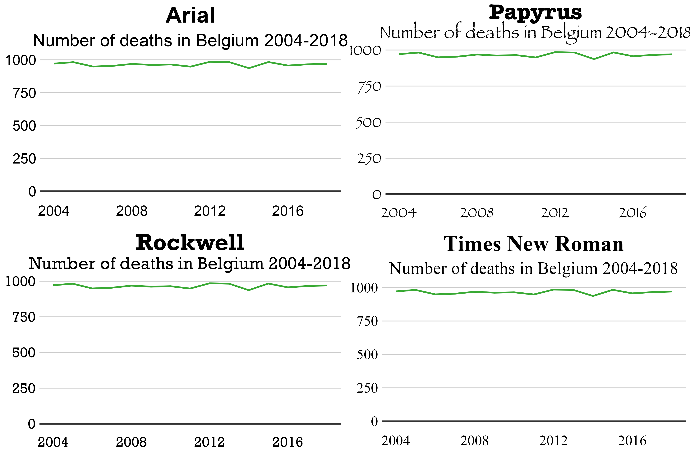

```{r, include = FALSE}
knitr::opts_chunk$set(
  collapse = TRUE,
  comment = "#>"
)
```

```{r setup, echo=FALSE}
library(ggsano)
```

## How to add a custom font to a chart

Adding a custom fond to a graph is possible via the `extrafont` package. More information on the package can be found [here](https://github.com/wch/extrafont). The package can be installed and loaded by running the following code:

```r
install.packages("extrafont")
library(extrafont)
```

## Installing and importing fonts

Once the package is installed, you can check the available fonts on your system by running `fonts()`. If a specific font is not available on your system, you can install it, and then run `font_import()`. `font_import()` will scan your system for any installed fonts that are not registered in R, and will register them. Once you have *installed* and *imported* new fonts, they are available on R. Fonts should be specified in the `sciensano_style(font = "XXXX")` function.

```{r, echo = FALSE}

```
